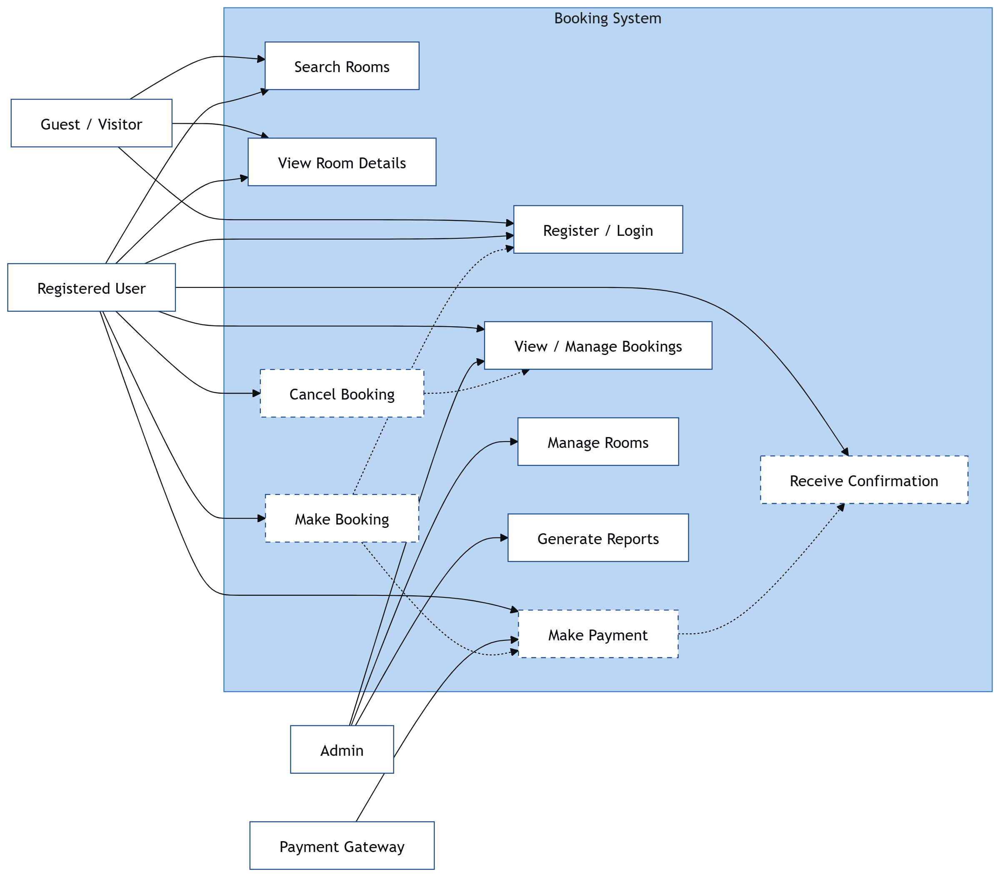

# Requirement Analysis in Software Development

This repository explores the process and importance of Requirement Analysis within the Software Development Life Cycle (SDLC). It serves as a foundation for understanding how clear requirements contribute to successful software delivery.

## What is Requirement Analysis?

Requirement Analysis is the process of identifying, documenting, and managing the needs and expectations of stakeholders for a software system. It ensures developers understand **what the system should do** before coding begins.

It helps translate vague business ideas into clear, actionable, and testable requirements, forming the blueprint for design and development.
## Why is Requirement Analysis Important?

1. **Prevents Miscommunication:** Ensures all stakeholders share a common understanding of project goals.
2. **Saves Time and Cost:** Detecting issues early in requirements prevents costly rework later.
3. **Improves Quality:** Well-defined requirements lead to more robust, user-centered software.

## Key Activities in Requirement Analysis

- **Requirement Gathering:** Collecting needs from stakeholders.
- **Requirement Elicitation:** Asking questions, interviews, and surveys to uncover real needs.
- **Requirement Documentation:** Recording requirements clearly using documents or tools.
- **Requirement Analysis and Modeling:** Evaluating and structuring requirements using diagrams and models.
- **Requirement Validation:** Ensuring documented requirements match stakeholder expectations.

## Types of Requirements

### Functional Requirements
Define what the system should do.

**Examples (Booking Management System):**
- Users can search for available rooms.
- Admins can update room availability.
- Customers can make, view, or cancel bookings.

### Non-Functional Requirements
Describe how the system performs.

**Examples:**
- The system should respond to user actions within 2 seconds.
- The app must handle 1,000 concurrent users.
- Data should be backed up daily and securely stored.

## Use Case Diagrams

Use Case Diagrams visually represent the interactions between **actors (users or systems)** and **use cases (system functions)**.

**Benefits:**
- Clarify system boundaries and responsibilities.
- Provide a simple, high-level view of user interactions.

### Booking Management System – Use Case Diagram

## Acceptance Criteria

Acceptance Criteria define the conditions that must be met for a feature to be considered complete. They ensure clarity between developers, testers, and stakeholders.

**Example (Checkout Feature):**

- User can review booking details before payment.
- System displays correct total cost including taxes.
- Payment is processed successfully via integrated gateway.
- Confirmation email is sent after successful payment.

These criteria make testing straightforward and ensure the feature aligns with user expectations.

